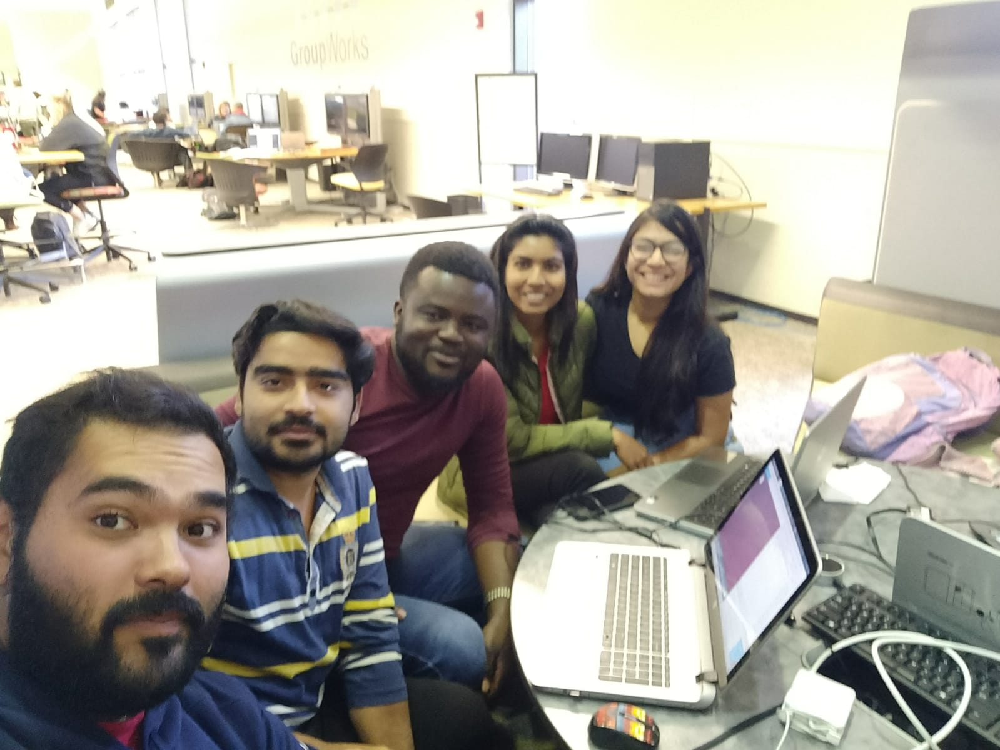

# GottaCatch'emALL
### Team Members & Responsibilites

<caption>Anubhav Tiwari (Developer); Ayodeji Ejiade (UI/UX Developer); Zacharias E. Alaniz (Team Leader); Vaidehi Piyush Pandya (Developer/QA Tester) Aneesha Baby(Developer)</caption>

### Sketch

### Main Functions To be Supported
1.) Points on collecting each apple.
2.) Milestones or Target Score to Reach Next Level.
3.) Game over when you lose 3 lives (or three apples couldn't be collected).
4.) Game over when timer runs out and level target is not reached.
5.) Difficulty increases as levels increase.
6.) Hand Gesture Control of the Basket (Based on Webcam).

### Implementation
<table width="100%">
<tr>
<th>Phase</th><th>Status</th><th>Next Steps</th>
</tr>

<tr>
<td>Requirement Gathering and Analysis</td><td>Completed</td><td>Design</td>
</tr>

<tr>
<td>Design</td><td>Completed</td><td>Implementation or Coding</td>
</tr>

<tr>
<td>Implementation or Coding</td><td> In progress</td><td>Testing</td>
</tr>

<tr>
<td>Testing</td><td>TBA</td><td>Deployment</td>
</tr>

<tr>
<td>Deployment</td><td>TBA</td><td>Presentation</td>
</tr>

</table>

- - - -
