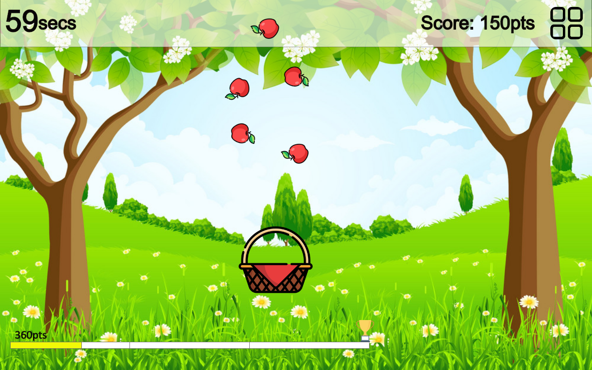
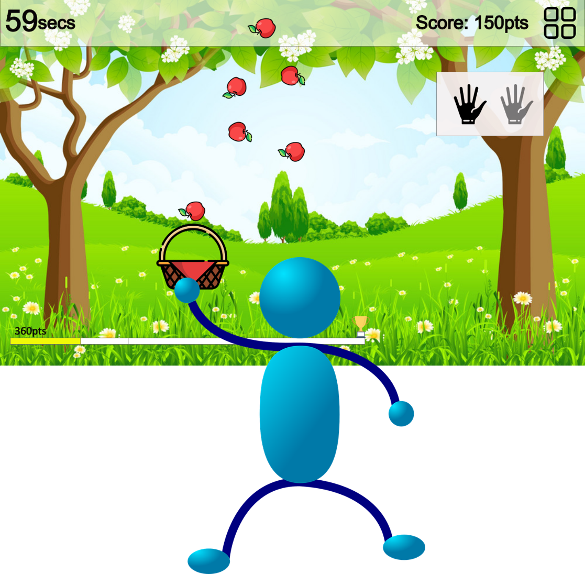

# GottaCatch'emALL
### Team Members & Responsibilites

<caption>Anubhav Tiwari (Developer); Ayodeji Ejiade (UI/UX Developer); Zacharias E. Alaniz (Team Leader); Vaidehi Piyush Pandya (Developer/QA Tester) Aneesha Baby(Developer)</caption>

### Sketch

### Main Functions To be Supported
1.) Points on collecting each apple. 
2.) Milestones or Target Score to Reach Next Level. 
3.) Game over when timer runs out and level target is not reached. 
4.) Difficulty increases as levels increase. 
5.) Hand Gesture Control of the Basket (Based on Webcam). 

### Implementation
<table width="100%">
<tr>
<th>Phase</th><th>Status</th><th>Next Steps</th>
</tr>

<tr>
<td>Requirement Gathering and Analysis</td><td>Completed</td><td>Design</td>
</tr>

<tr>
<td>Design</td><td>Completed</td><td>Implementation or Coding</td>
</tr>

<tr>
<td>Implementation or Coding</td><td>Completed</td><td>Testing</td>
</tr>

<tr>
<td>Testing</td><td>Completed</td><td>Deployment</td>
</tr>

<tr>
<td>Deployment</td><td>Completed</td><td>Presentation</td>
</tr>

</table>

### Plan to move forward

Design of the game is completed and we have started working on implementing the game using HTML5, CSS and javascript. We will be using handtrack.js to implement hand gesture control in this game.

Design of the game is completed and we have started working on implementing the game using HTML5, CSS and javascript. We will be using handtrack.js to implement hand gesture control in this game.

### References
1. https://www.tensorflow.org/
2. https://towardsdatascience.com/how-to-build-a-gesture-controlled-web-based-game-using-tensorflow-object-detection-api-587fb7e0f907
3. https://github.com/tensorflow/models/tree/master/research/object_detection

### Demo Link
<a href = "https://man-on-thoughts.github.io/P2Group13/game13/">Demo Link</a>

### Task Description

- The user has to use mouse interaction to collect apples in the basket
- User has to collect apples to earn points 

### Hypothesis

- The User uses mouse interaction to move Basket
- - - -
### The Focus of this product on the users' end. 
  * Age group: Childern 7-13 
  * Gender Friendly
  * Language: English 
  * Education: Must have a clear concept of elementry level mathematics
  * Cultural Background: Culture friendly
  * Job: not relevant
 - - - - 
### Novice users
  * User friendly 
  * simple to user
- - - - 
### Knowledegable users 
  * General knowledge and easy
- - - -
### Expert users 
* should have no problems with this game
- - - -
### The Actions of the Game
* Move the basket with mouse to collect apples
* Control the basket with movement of hand
* Each apples has certain points associated with it.
* The objective is to collect as many points as possible to proceed to next levels within stipulated time.
- - - - 
